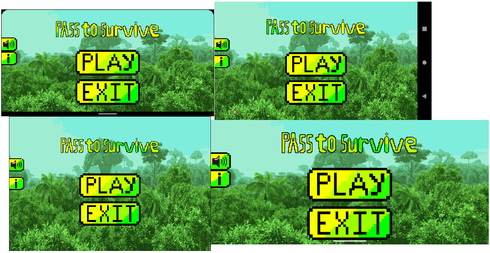

> [!IMPORTANT]
> **This repository is currently under construction. But key features are already written here. Thank you very much!** 

<h1 align=center>Pass To Survive</h1>

<!--  -->

## Description

This game is a demo of my skills, knowledge with Java & [libGDX](https://github.com/libgdx/libgdx).\
**Stack: Java 21, Gradle 8.10, libGDX 1.10, Lombok 1.18, Maven, Android Studio, Tiled (TMX Maps).**

## Key Features

* **Inheritance** from [`PlayGameScreen`](core/src/com/company/passtosurvive/levels/PlayGameScreen.java) abstract class with **Builder** & effective usage of abstract method `setCheckpoint` for [`Level`](core/src/com/company/passtosurvive/levels) Classes.
    * For [`PlayGameScreen`](core/src/com/company/passtosurvive/levels/PlayGameScreen.java), I created **Builder** myself b/c inheritance required `super`. 
* reuse of some assets to not overload **Java Garbage Collector** when screen **disposes**.
* [Lombok](https://projectlombok.org/) for less code space, it automates creation of Builders, Setters, Getters, & many more.
* [`TileObject`](core/src/com/company/passtosurvive/models/TileObject.java) abstract class, to make contactListener call `inContactAct` method to trigger actions corresponding to the specific [`TileObject` child](core/src/com/company/passtosurvive/models).
* Created joystick by implementing [`Joystick`](core/src/com/company/passtosurvive/control/Joystick.java) class with Actor inheritance for communication with libGDX API & implementing [`JoystickInputListener`](core/src/com/company/passtosurvive/control/JoystickInputListener) class for touch control which communicates with App using libGDX API.
* Active usage of diverse files to provide graphics, sound, animation, buttons, & text:
    * `.pack` - texture packs, tell the game in which part of a png file, the specific image is located.
    * `.json` - needed for all buttons in the game to set them a texture (pressed & released) from the `AllComponents.pack` file.
    * `.tmx` - maps that contains position for all the graphics & physical bodies on maps, use `.png` files as source of graphics.
* Doesn’t use Viewport to scale graphics, all graphics are optimized for different screens using just the coefficient of width & height to screen for which graphics was originally scaled. This **ensures original aspect of ratio for every graphics**. Example below:

<!-- - This game is a platformer that has 2 levels and 2 skins for the player model. The first skin is pretty basic, and the second skin is a character from one of my favorite Japanese series; it is automatically placed on the player’s model after 20 restarts in the game. After 20th restart, the game will show special animation for second skin instead of "Game Over" screen. It was added to the game as an Easter egg. The player runs at a constant speed, no matter how far you pull the joystick. Levels are divided into two parts with smooth transitions. Everything in this game is animated except static objects of worlds. There are two different "Game Over" screens, two different "Win" screens, and a "Pause" screen. After completing one level, the player will be prompted to complete another one, no matter which one he completed. The game works in native resolution and native refresh rate of the phone. The game was tested on Pixel 1, Pixel 2, Samsung Galaxy Fold, and some old devices. The game works perfectly on phones with Android 7 and higher. By the way, I made it on Java 17 and Android Gradle Plugin 7. So if you open it in the latest Android Studio version with newer Java, it could give you some warnings, but the code will work. On older Java and/or Android Studio, it may not be able to work. -->
<!-- - I used LibGDX (a game engine for Android Studio based on Java) to implement gravity, jumping, bouncing, etc. LibGDX is a popular Java-based engine for creating games on android. The engine also compatible with PCs. In LibGDX, there are vector classes for vector quantities, such as force. In the course, there were no tutorials for game development. The course was teaching how to develop apps. So, I did self-study of Android Game Development in order to create this project. Sometimes, the player model seems to be touching the hazardous, but it does not because the hit box of the player model is a rectangle of size smaller than the graphical model of the player. You can see it in game if you turn on one command in the level class where you want to see it. I commented the command so that you can simply uncomment it to see the hit boxes. The hit box of the player is made by LibGDX, and the hit boxes of other static objects are made by tmx files (files for maps that include these hit boxes and graphics). The Y coordinate of the joystick is functional, but it is not used in the game. -->
